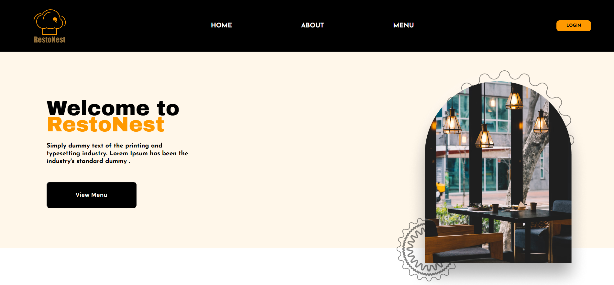

# OdinRestaurantPage
### Odin course restaurant homepage dinamicaly rendered by JavaScript.

## Built With
- Vanilla JS
- HTML5
- CSS3

## Live Demo
[Resto Nest Restaurant](https://bymajka.github.io/OdinRestaurantPage/)

## How Works
1. Clone this project:
   `git clone https://github.com/bymajka/OdinRestaurantPage.git`
2. Once you have cloned this project, you can install the required dependencies by using:
   `npm install`
3. A live demo of the project can be started by using:
   `npx webpack serve`
4. After webpack compiled succesfully, project will be running at:
   `http://localhost:8080/`
